<h1 align="center">:fire: TryHackMe OhSINT room :fire: </h1>

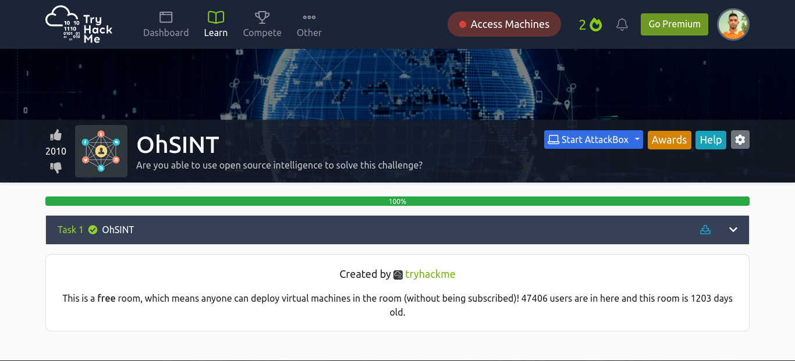 

TryHackMe [Room link](https://tryhackme.com/room/ohsint) 

## Task 1: OhSINT
### Q: What is this users avatar of?
Download this file by clicking that button 
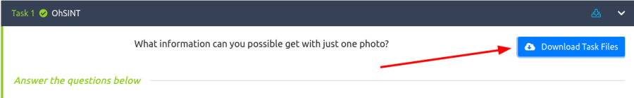 

You need `Exiftool` tool. Exiftool installation command 

    sudo apt install exiftool -y

Run this command where you Download the image 

    exiftool WindowsXP.jpg
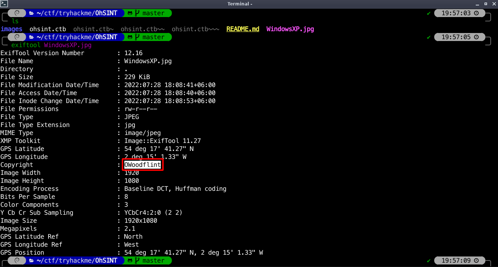 

Now copy `OWoodflint` this text and Search on [Google](https://www.google.com). Let's visit first link which is twitter. 
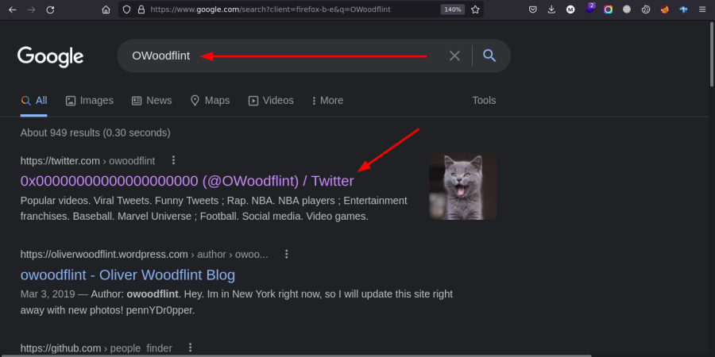 

We've found exact username and the users avatar of a `cat`.
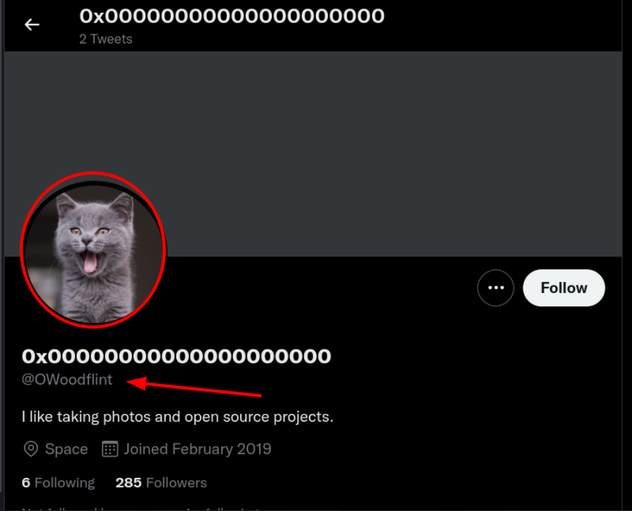 

#### A: `cat`

### Q: What city is this person in?
Let's open third link of search result which is Github. 
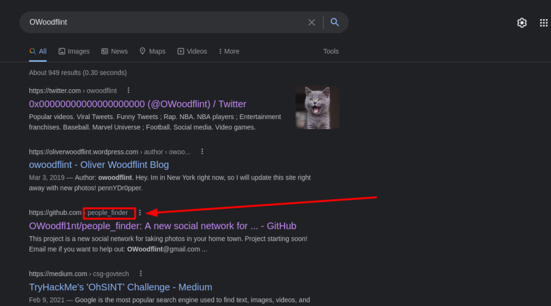 

As you can see the same person of github account and his location is `London`.
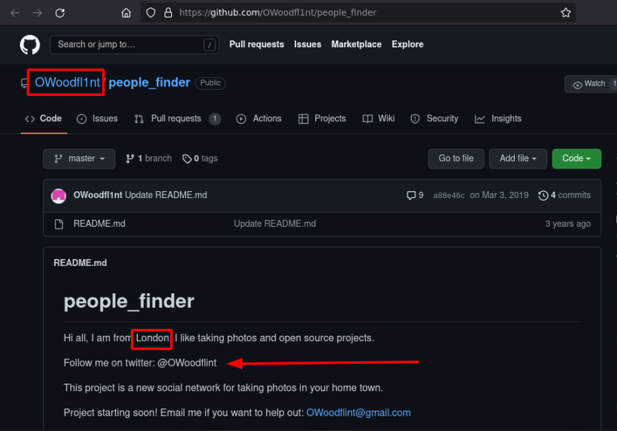 

#### A: `London`

### Q: Whats the SSID of the WAP he connected to?
Again go to this `twitter account` and scroll down, copy the bssid `B4:5D:50:AA:86:41`
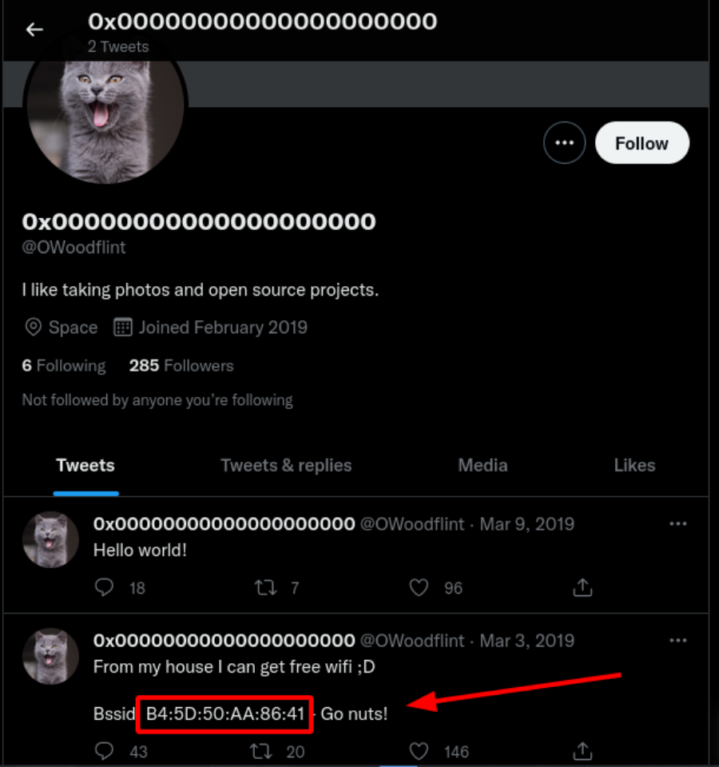 

Search `wigle` on [Google](https://www.google.com) and visit the website. 
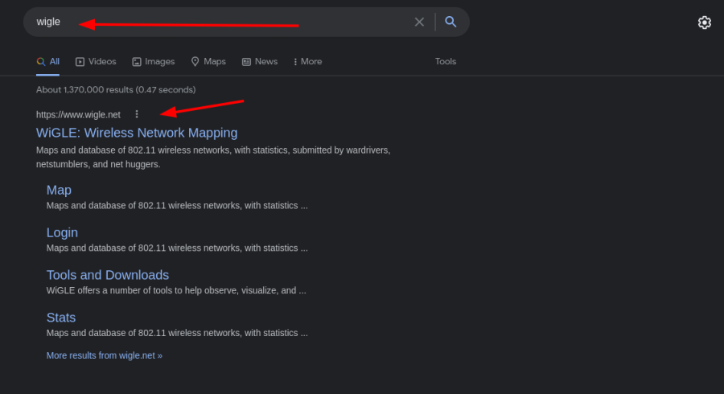 

Past the BSSID click on `Filter` and find the location pointer and it's `UnileverWiFi`. 
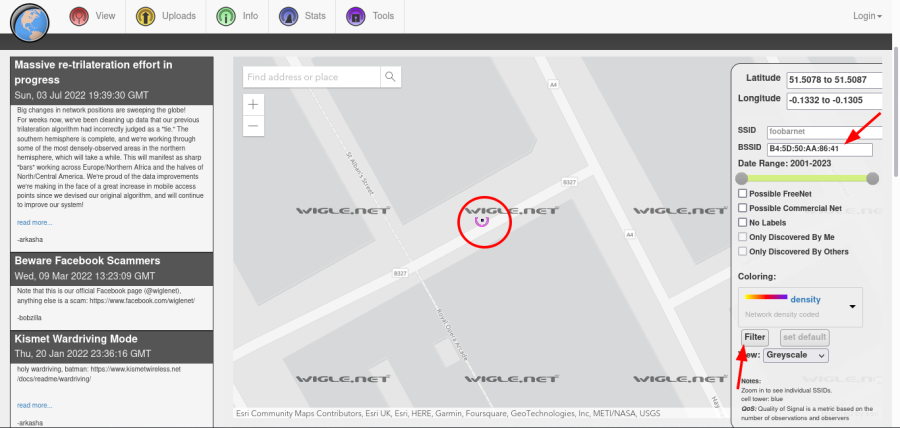 

#### A: `UnileverWiFi`

## Q: What is his personal email address?
Go to this `Github account` and search the gmail id. 
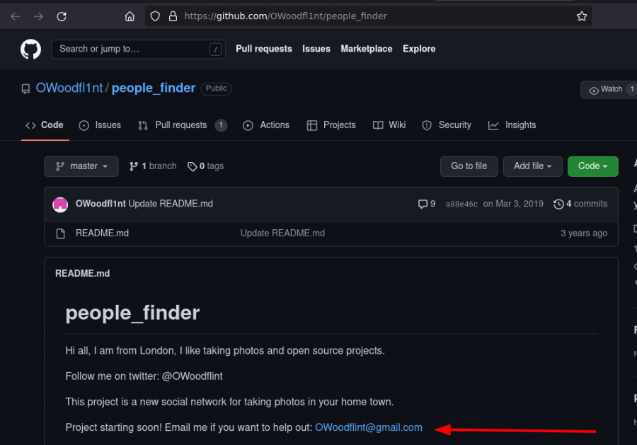 

#### A: `OWoodflint@gmail.com`

## Q: What site did you find his email address on?
#### A: `Github`

## Q: Where has he gone on holiday?
Go to this link 
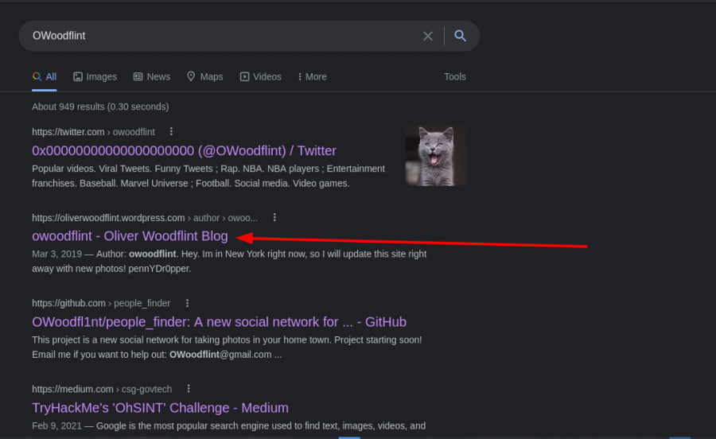 

As you can see He is in New York now. 
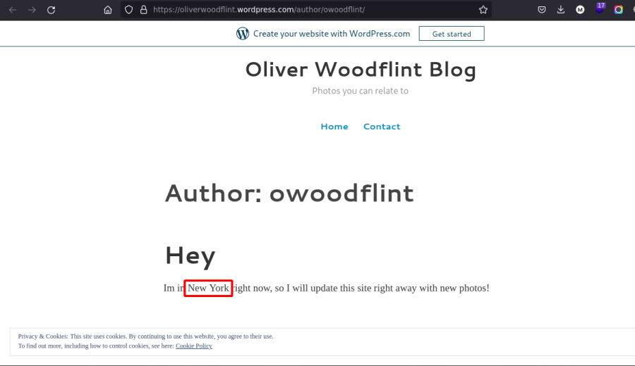 

#### A: `New York`

## Q: What is this persons password?
When I drag by mouse it's highlighted and found the password. 
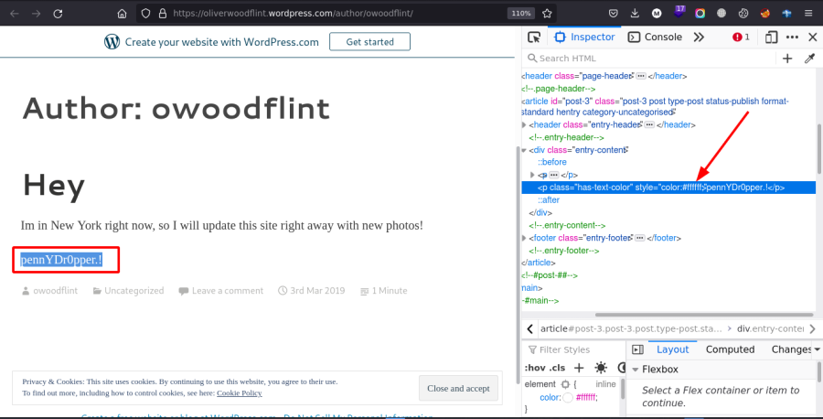 

#### A: `pennYDr0pper.!`

<h3 align="center">Congratulations, Finished the room.</h3>