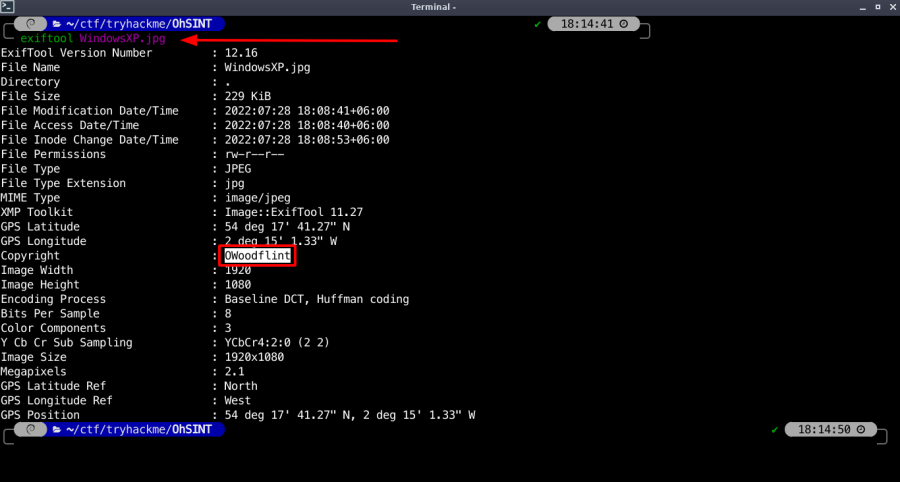

<h1 align="center">:fire: TryHackMe OhSINT room :fire: </h1>

 

TryHackMe [Room link](https://tryhackme.com/room/ohsint) 

## Task 1: OhSINT
### Q: What is this users avatar of?
Download this file by clicking that button 
 

You need `Exiftool` tool. Exiftool installation command 
    sudo apt install exiftool -y

Run this command where you Download the image 
    exiftool WindowsXP.jpg
 